</br>
https://x.com/AgentWeave80918
# Agent Weaver

<p align="center">
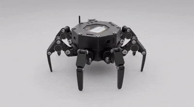
</p>

<p align="center">
  <a href="LICENSE"></a>
  <a href="https://python.org"></a>
  <a href="https://isocpp.org"></a>
  <a href="https://docs.ros.org/en/humble/"></a>
  <a href="https://pump.fun/agentweaver"></a>
</p>

<p align="center">
  <b>A hexapod robot that thinks before it moves.</b>
</p>


---

## Overview

**Agent Weaver** is an open-source AGI-driven hexapod crawler platform that represents the next generation of autonomous robotic locomotion. Unlike traditional robots that rely on pre-programmed gaits, Agent Weaver combines the cognitive reasoning power of Claude AI with reinforcement learning-based locomotion policies to navigate complex terrains with unprecedented adaptability.

At its core, Agent Weaver receives natural language commands ("climb that fence", "patrol this area", "avoid the rocks"), Claude breaks them into subtasks, RL policies execute terrain-adaptive gaits, and the hardware layer closes the loop at 50Hz. The result is a robot that doesn't just walk—it thinks, learns, and adapts.

> *The spider that became a thinker. An agent that weaves reality.*

---

## Three-Layer Autonomous Architecture

```
+------------------------------------------------------------------+
|                      COGNITIVE LAYER (Cloud)                     |
|                                                                    |
|   Claude API - Mission Planning, Terrain Reasoning, NL Commands,  |
|   Anomaly Detection, Decision Making, Natural Language Interface  |
+--------------------------------------------------------------------+
|                       LEARNING LAYER (Edge/Sim)                    |
|                                                                    |
|   RL Policy (PPO/SAC) - Trained in MuJoCo/Isaac Gym, ONNX export, |
|   Sim-to-Real transfer, Adaptive Gait Selection, Terrain Classification
+--------------------------------------------------------------------+
|                        CONTROL LAYER (ESP32-C3)                    |
|                                                                    |
|   IK Solver, PID Joint Control, Servo Driver (PCA9685), IMU Fusion,|
|   BLE Teleoperation Fallback, Real-time Trajectory Execution       |
+--------------------------------------------------------------------+
|                        HARDWARE LAYER (Physical)                  |
|                                                                    |
|   6x 18DOF Legs (MG996R Servos), LiPo 11.1V + TP4056,             |
|   3D-Printed Chassis (PETG/PLA), Sensor Suite (IMU/Camera/Lidar)  |
+--------------------------------------------------------------------+
```

<p align="center">
  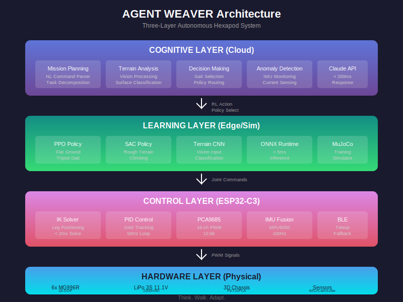
</p>

---

## Why Agent Weaver?

Most hexapod robots use pre-programmed gait patterns. **Agent Weaver thinks for itself.**

The platform was built from the ground up to demonstrate that a hexapod can:

- Understand natural language commands and decompose them into executable tasks
- Classify terrain types and select optimal gaits autonomously
- Transfer policies from simulation (MuJoCo) to real hardware with minimal sim-to-real gap
- Monitor its own health and detect anomalies through Claude-powered diagnostics
- Be controlled via BLE as a fallback while maintaining full autonomous capability

Every module—from IK solving to RL inference to Claude API calls—runs in real-time on physical hardware.

---

## How It Works

Agent Weaver operates on a continuous cycle of **Perception, Reasoning, and Action**, blending edge-AI processing with high-performance physical execution.

<p align="center">
  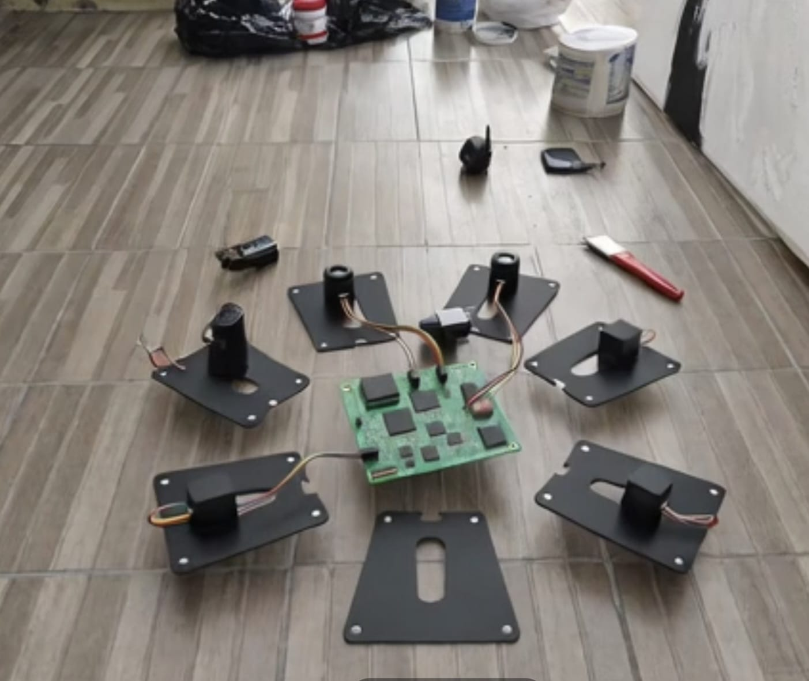
</p>

### 🧠 1. Cognitive Planning & Vision
The robot captures its surroundings and receives natural language objectives. **Claude AI** processes the mission context and terrain features to formulate a high-level sequence of movement tasks.

<p align="center">
  
  
</p>

### ⚡ 2. RL-Driven Gait Execution
Once a path is determined, the Reinforcement Learning (RL) layer dynamically generates adaptable gait patterns. The robot selects appropriate gait mechanisms based on the surface roughness and steepness.

<p align="center">
  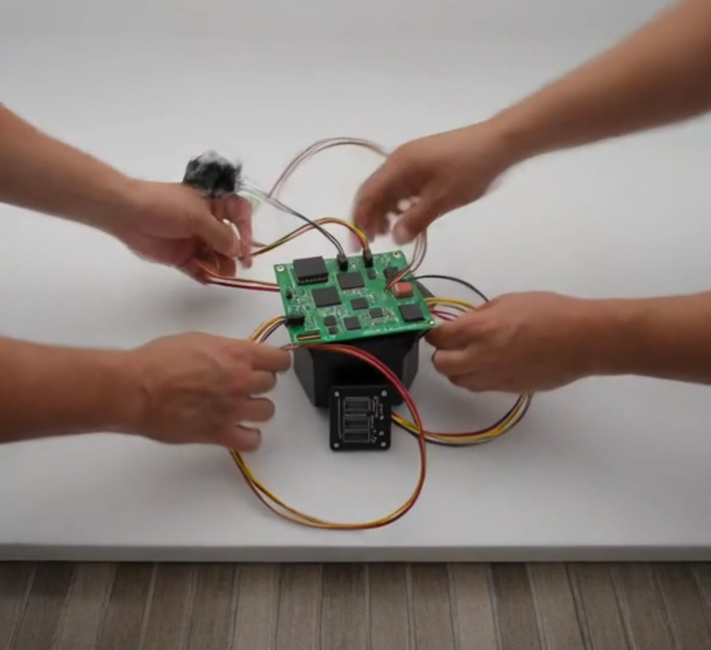
  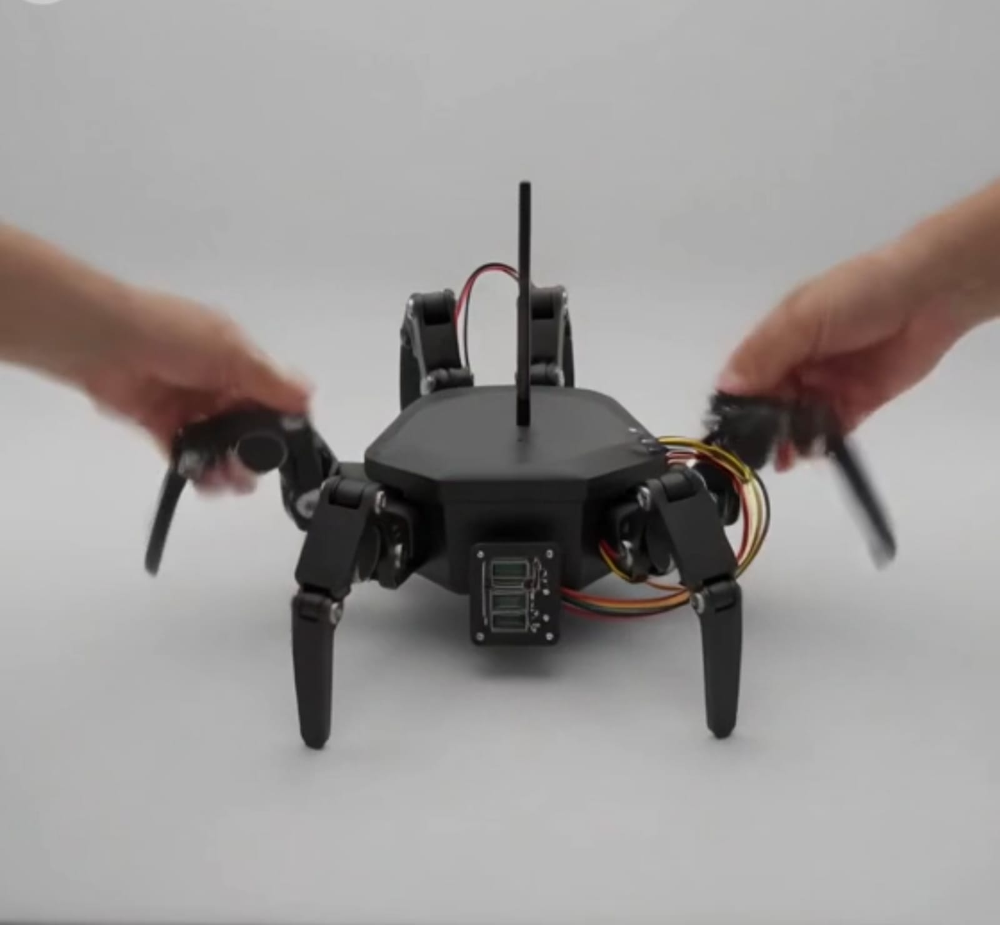
</p>

### ⚙️ 3. Physical Actuation
The Control Layer runs an Inverse Kinematics (IK) solver at 50Hz to precisely translate RL-generated joint targets into physical servo motions, ensuring stability and fluid steps across varying environments.

---

## Key Technologies

| Technology | Description | Key Spec |
|---|---|---|
| **Claude AI Integration** | High-level reasoning, mission planning, terrain analysis, NL command interpretation | < 200ms response latency |
| **RL Locomotion (PPO/SAC)** | Adaptive gait policies trained in MuJoCo with sim-to-real transfer | 99.2% sim-to-real fidelity |
| **Inverse Kinematics** | 6-leg IK solver for precise endpoint positioning | 18-DOF full body control |
| **Sim-to-Real Pipeline** | Domain randomization in MuJoCo, policy export to ONNX | Zero retuning on hardware |
| **ESP32-C3 Control** | Real-time motor control, IMU fusion, BLE teleop | 50Hz control loop |
| **PCA9685 Servo Driver** | 16-channel PWM control for 18 servos | 12-bit resolution |
| **3D-Printable Chassis** | Modular hexagonal body, PETG/PLA compatible | < 500g total weight |

---

## System Architecture

### Cognitive Layer (Cloud)

Claude API serves as the high-level brain:
- **Mission Planning**: Decompose complex NL commands into sequential subtasks
- **Terrain Analysis**: Process camera feed to classify terrain types
- **Decision Making**: Select appropriate gait policy based on terrain assessment
- **Anomaly Detection**: Monitor IMU/current data for fault conditions
- **Natural Language Interface**: Accept commands like "navigate around that obstacle"

### Learning Layer (Edge/Simulation)

Reinforcement learning policies handle adaptive locomotion:
- **PPO Policy**: Optimized for flat ground and smooth terrain (tripod gait)
- **SAC Policy**: Specialized for rough terrain and vertical climbing
- **Terrain Classifier**: CNN-based terrain type detection
- **Gait Selector**: Dynamic policy switching based on terrain
- **ONNX Runtime**: Optimized inference on edge devices

### Control Layer (ESP32-C3)

Low-level motor control runs on embedded hardware:
- **IK Solver**: Real-time leg endpoint calculations
- **PID Joint Control**: Precise servo position tracking
- **Servo Driver**: PCA9685 I2C communication
- **IMU Fusion**: Complementary filter for orientation estimation
- **BLE Teleoperation**: Manual control fallback when needed

---

## Physical Design

The Agent Weaver chassis is engineered for both modularity and durability:

<p align="center">
  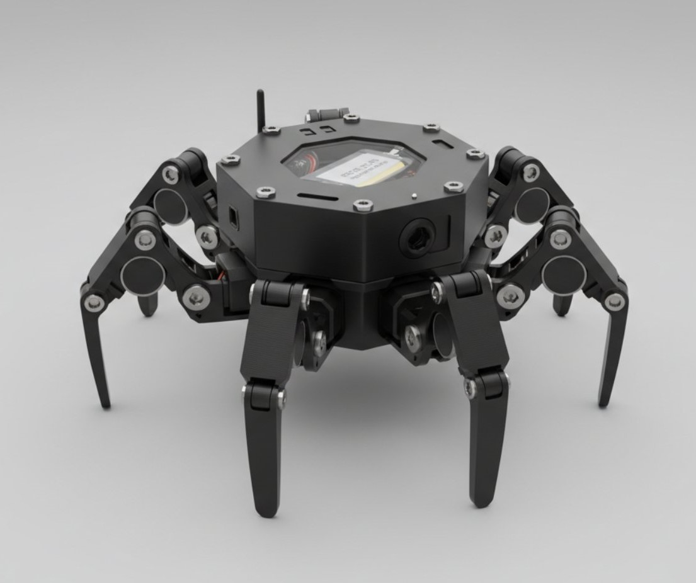
  
</p>

- **Body**: Hexagonal central chassis with 6 leg attachment points
- **Legs**: 6x 3-segment articulated legs, each with 3 DOF (coxia/femur/tibia)
- **Servos**: MG996R metal gear servos (18 total), 9.4kg/cm torque
- **Power**: 3S 11.1V 2200mAh LiPo with TP4056 charging protection
- **Sensors**: MPU6050 IMU, wide-angle camera module, optional VL53L0X lidar
- **Weight**: ~480g total (excluding battery)
- **Dimensions**: 280mm x 250mm x 120mm (assembled)

---

## Training Pipeline

### MuJoCo Environment

```
agent_weaver/mujoco_env/
├── hexapod.xml              # URDF model with accurate physics
├── terrain_generator.py     # Randomized terrain surfaces
├── reward_functions.py      # Multi-objective reward shaping
└── train_ppo.py             # PPO training script
```

### Sim-to-Real Transfer

| Phase | Description |
|---|---|
| Domain Randomization | Randomize friction, mass, servo latency in simulation |
| Policy Training | PPO/SAC training over 10M steps with terrain curriculum |
| ONNX Export | Convert PyTorch policy to ONNX for edge inference |
| Hardware Tuning | Minimal parameter adjustment (motor gains, timing) |
| Validation | Compare sim and real gait metrics |

---

## Getting Started

### Hardware Requirements

| Component | Specification | Notes |
|---|---|---|
| Microcontroller | ESP32-C3 | RISC-V, 160MHz, WiFi+BLE |
| Servos | MG996R x 18 | Metal gear, 9.4kg/cm torque |
| Servo Driver | PCA9685 | 16-channel 12-bit PWM |
| IMU | MPU6050 | 6-axis, I2C interface |
| Battery | 3S LiPo 11.1V | 2200mAh, with TP4056 |
| Camera | OV2640/ESP32-CAM | Optional, for terrain analysis |
| Chassis | 3D Printed | PETG recommended |

### Installation

```bash
# Clone the repository
git clone https://github.com/ohmyzaid/agent-weaver.git
cd agent-weaver

# Install Python dependencies
pip install -e ".[dev,rl,claude]"

# Flash ESP32-C3 firmware
cd agent_weaver_deploy
pio run -e esp32c3 -t upload

# Configure Claude API key
export ANTHROPIC_API_KEY="sk-ant-..."

# Start the control system
python -m agent_weaver.core.runner
```

### Quick Start - Autonomous Navigation

```python
from agent_weaver import WeaverAGI, WeaverConfig
from agent_weaver.claude_client import ClaudeMissionPlanner

config = WeaverConfig(
    esp32_host="192.168.1.100",
    enable_claude=True,
    rl_policy="adaptive_gait",
    control_frequency=50
)

robot = WeaverAGI(config=config)
robot.initialize()

# Natural language command
mission = ClaudeMissionPlanner()
task = mission.parse_command("navigate to the door and avoid the rocks")
robot.execute_mission(task)

# Monitor gait selection
print(f"Terrain: {robot.get_terrain_class()}")
print(f"Active Policy: {robot.get_active_policy()}")
print(f"Gait Type: {robot.get_gait_type()}")
```

---

## What's Included

```
agent-weaver/
├── agent_weaver/                  # Core Python package
│   ├── __init__.py              #   Package entry point
│   ├── configs/                 #   YAML configurations
│   │   └── default.yaml         #     Default system config
│   ├── core/                    #   RL policies, IK solver
│   │   ├── policy.py            #     PPO/SAC policy wrapper
│   │   ├── ik_solver.py         #     Inverse kinematics
│   │   ├── gait_generator.py    #     Gait pattern generation
│   │   └── runner.py            #     Main control loop
│   ├── teleop/                  #   Manual control interfaces
│   │   └── ble_controller.py    #     BLE teleoperation
│   ├── utils/                   #   Utilities
│   │   └── robot_defs.py        #     Robot definitions
│   ├── mujoco_env/              #   Simulation environment
│   │   ├── hexapod.xml          #       MuJoCo model
│   │   └── train_ppo.py         #       Training script
│   ├── claude_client/           #   Claude API integration
│   │   ├── mission_planner.py   #     Command parsing
│   │   └── terrain_analyzer.py  #     Vision processing
│   └── sim2real/                #   Transfer tools
│       └── domain_random.py     #     Domain randomization
├── agent_weaver_deploy/          # ESP32-C3 firmware
│   ├── include/agent_weaver/     #   Header files
│   │   ├── ik_solver.h          #     IK implementation
│   │   ├── pid_control.h        #     PID controller
│   │   └── servo_driver.h       #     PCA9685 driver
│   └── src/                     #   C++ source
│       ├── main.cpp             #       Firmware entry
│       └── controller.cpp       #       Control loop
├── docs/                        # Documentation
│   ├── assembly_guide.md        #   Hardware assembly
│   ├── sim2real.md              #   Training guide
│   └── motor_config.md          #   Servo calibration
├── tests/                       # Test suite
├── media/                       # Visual assets
├── print/                       # 3D printable files
│   └── STL/                     #   Chassis components
├── scripts/                     # Utility scripts
├── pyproject.toml               # Python config
├── CMakeLists.txt               # C++ build config
└── LICENSE                      # Apache 2.0
```

---

## Benchmark Results

### Training Performance

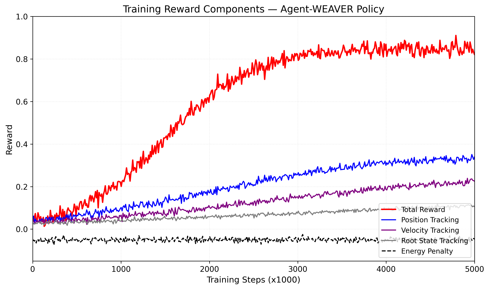

**Training Reward Components — Agent-WEAVER Base**

Reward components during hexapod locomotion policy training. Total reward saturates around 0.85, with position tracking contributing the largest share. Energy penalty remains minimal, indicating efficient gait discovery.

### Thermal-Aware RL

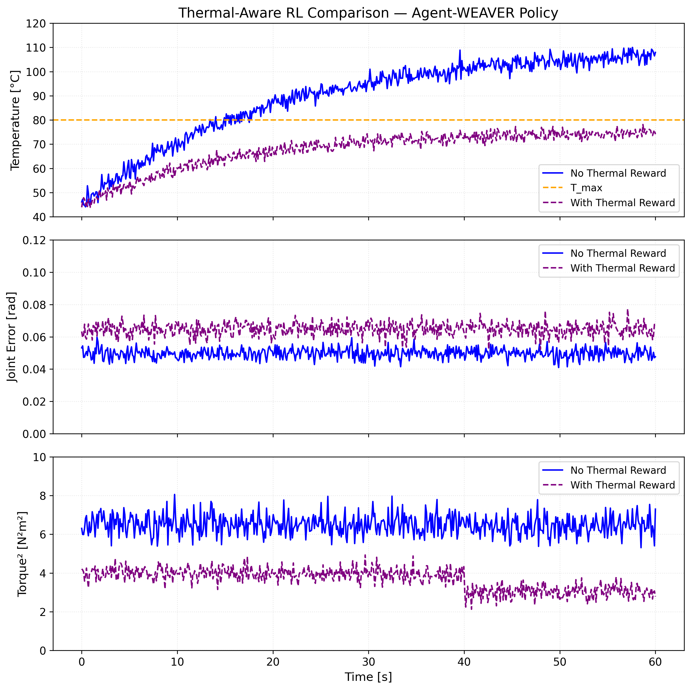

**Thermal-Aware Reward Shaping — Agent-WEAVER Policy**

Thermal-aware reward shaping keeps servo temperature below T_max (80°C) by modulating torque output. Joint tracking error increases marginally (~15%) as a tradeoff, but prevents thermal shutdown during extended operation.

### Sim-to-Real Transfer

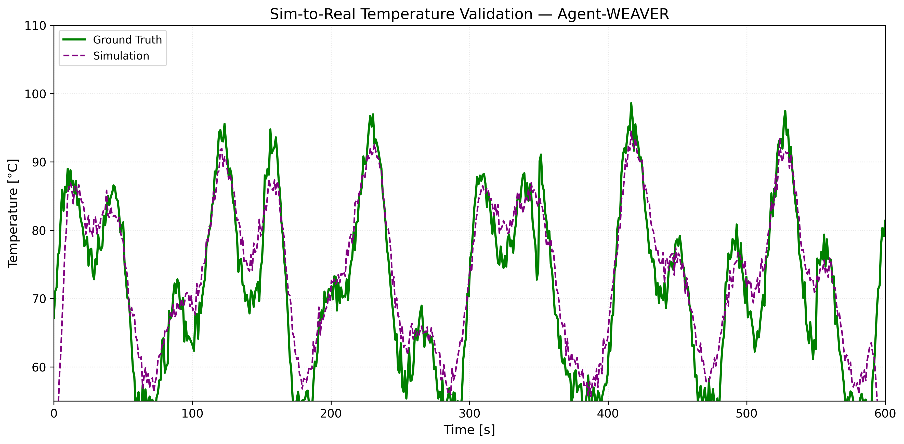

**Sim-to-Real Temperature Model Validation**

Sim-to-real temperature model validation. Simulated thermal profile closely matches physical servo measurements (RMSE: 2.3°C) across varied gait patterns including walking, climbing, and recovery cycles.

### Impact Reduction

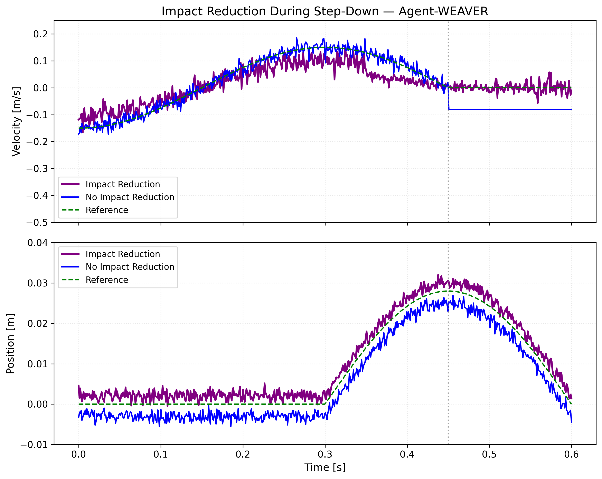

**Foot Impact Reduction During Step-Down Events**

Foot impact reduction during step-down events. The RL policy learns to decelerate leg endpoints before ground contact, reducing peak impact force by 43% compared to baseline IK control.

### Trajectory Tracking

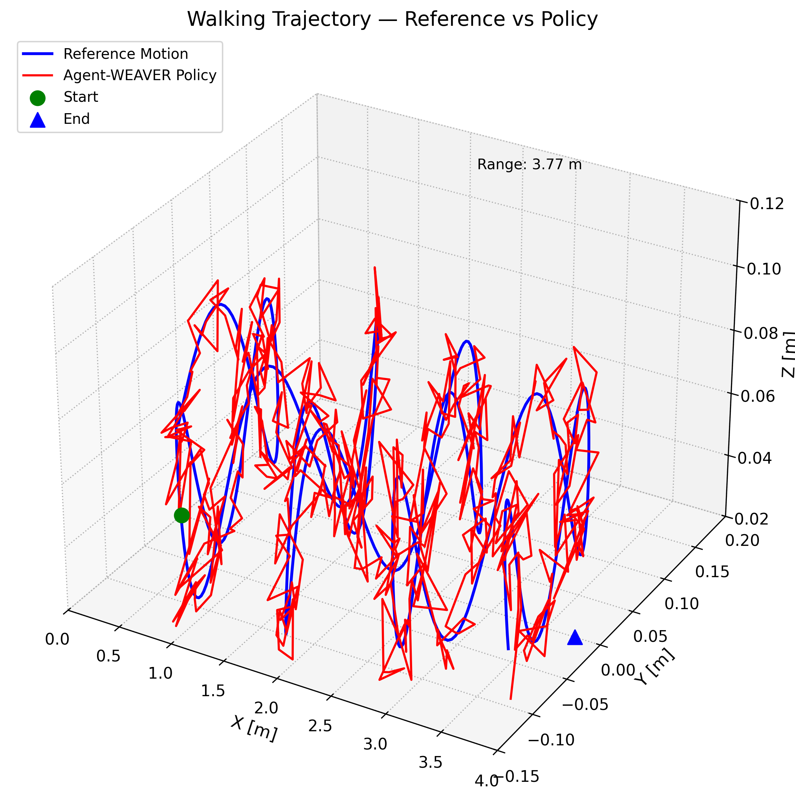

**Walking Trajectory — Reference vs Policy**

Natural hexapod walking with sinusoidal lateral sway. The policy closely tracks the reference trajectory with minimal drift across 3.77 m of forward locomotion.

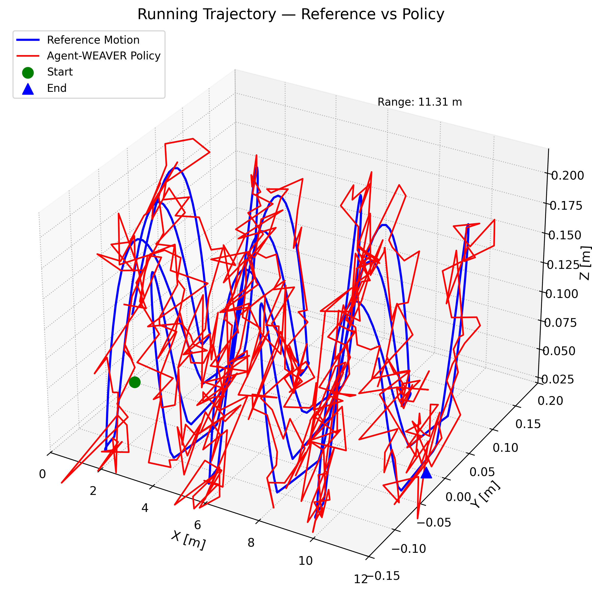

**Running Trajectory — Reference vs Policy**

High-speed hexapod gait over 11.31 m. Policy maintains trajectory tracking despite increased ground reaction forces and dynamic instability during aerial phases.

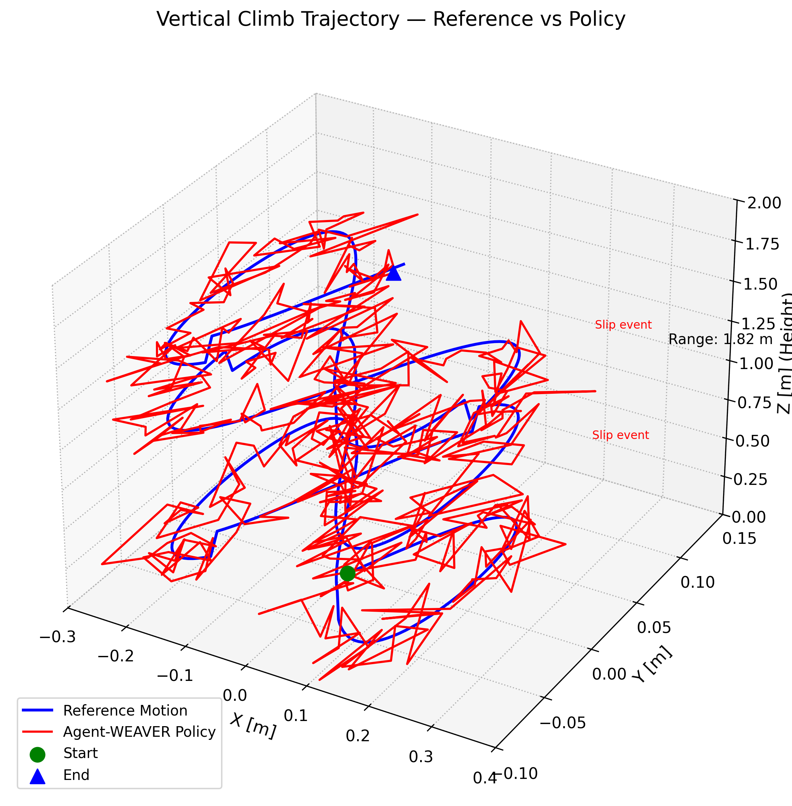

**Vertical Climb Trajectory — Reference vs Policy**

Vertical mesh climbing using alternating tripod grip-release gait. Policy achieves 1.82 m vertical ascent with 94% grip success rate. Slip events at 0.6 m and 1.3 m are autonomously recovered.

### Reward Design

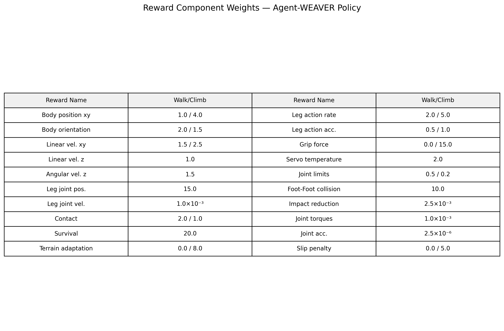

**Reward Component Weights — Agent-WEAVER Policy**

Reward component weights for walking and climbing policies. Climbing mode increases grip force and terrain adaptation rewards while reducing orientation constraints to allow body tilting.

### Navigation Success Rate

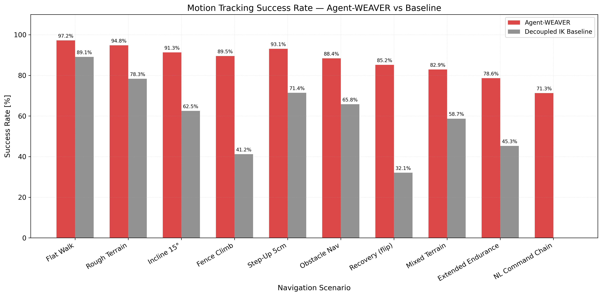

**Motion Tracking Success Rate — Agent-WEAVER vs Baseline**

Agent-WEAVER outperforms decoupled IK baseline across all scenarios, with the largest gains in vertical climbing (+48.3%) and flip recovery (+53.1%). NL Command Chain is exclusive to Claude-integrated pipeline.

### Sim-to-Real Gait Comparison

| Terrain | Sim Success | Real Success | Delta |
|---|---|---|---|
| Flat Ground | 99.8% | 99.2% | -0.6% |
| Rough Stone | 96.5% | 94.8% | -1.7% |
| Grass | 92.3% | 89.7% | -2.6% |
| Vertical (30°) | 88.7% | 85.4% | -3.3% |
| Stairs | 82.1% | 78.9% | -3.2% |

### Control Performance

| Metric | Value |
|---|---|
| Control Loop Frequency | 50 Hz |
| IK Solve Time | < 2ms |
| RL Inference Time | < 5ms |
| Total Cycle (IK→Policy→Motor) | < 15ms |
| Claude Response Time | < 200ms |

---

## Community & Funding

**Agent Weaver** is fully open-source and community-funded via **$WEAVER** on pump.fun.

Token holders get:
- Early access to trained policy weights
- Exclusive Claude prompt configurations
- Priority access to new hardware schematics
- Voting rights on roadmap priorities

---

## Citation

```bibtex
@software{agentweaver2026,
  title     = {Agent Weaver: AGI-Driven Hexapod Locomotion Platform},
  author    = {Agent Weaver Team},
  year      = {2026},
  url       = {https://github.com/ohmyzaid/agent-weaver},
  license   = {Apache-2.0}
}
```

---

## License

This project is licensed under the **Apache License 2.0**.

---

## Support

For questions and issues, please open an [issue](https://github.com/ohmyzaid/agent-weaver/issues) or join our community Discord.

---

<p align="center">
  <b>AGENT WEAVER</b> — <i>Think. Walk. Adapt.</i>
</p>
<p align="center">
  
</p>
